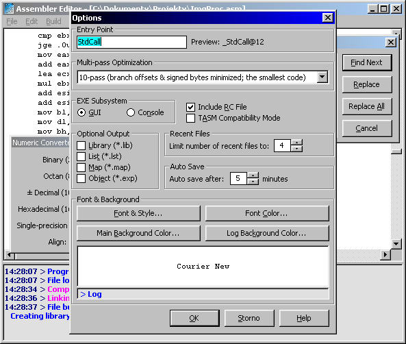



## ASMEditor 1\.0

### Description

This editor is only GUI application for Netwide Assembler. You can build binary file, dynamic-link library (DLL) or executable file (EXE). It has good compiler and linker error handlers (error line is highlighted after compiling). You can get help for any instruction or directive by pressing F1 (just like in Visual Basic).

Project has some executables not allowed on PSC, so download here (+ help + libs + samples +++):

http://flashlight.webpark.cz/eindex.htm
 
### More Info
 

             |
---                |---
**Submitted On**   |2002-08-24 14:03:44
**By**             |[Petr Supina](https://github.com/Planet-Source-Code/PSCIndex/blob/master/ByAuthor/petr-supina.md)
**Level**          |Advanced
**User Rating**    |5.0 (15 globes from 3 users)
**Compatibility**  |VB 6\.0
**Category**       |[Complete Applications](https://github.com/Planet-Source-Code/PSCIndex/blob/master/ByCategory/complete-applications__1-27.md)
**World**          |[Visual Basic](https://github.com/Planet-Source-Code/PSCIndex/blob/master/ByWorld/visual-basic.md)
**Archive File**   |[ASMEditor\_1220108242002\.zip](https://github.com/Planet-Source-Code/petr-supina-asmeditor-1-0__1-35201/archive/master.zip)

